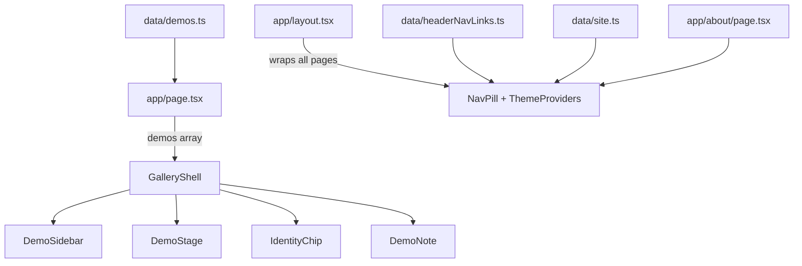

# File Structure

This project is a [Next.js](https://nextjs.org) App Router app: a sidebar of demo thumbnails, a live iframe preview, and a thin About/contact layer. Home is the gallery.

## Directory overview

```
portfolio/
├── app/                      # Next.js routes, layout, and global styles
├── components/               # React UI components
│   └── gallery/              # Gallery-specific components
├── data/                     # Static content (demos, nav links, site identity)
├── docs/                     # Project documentation
├── public/                   # Static assets served at /
├── next.config.ts            # Next.js config (images, CSP, headers)
├── package.json              # Dependencies and scripts
├── postcss.config.mjs        # PostCSS / Tailwind pipeline
└── tsconfig.json             # TypeScript paths and compiler options
```

Generated folders like `.next/` and `node_modules/` are build artifacts — you can ignore them.

---

## How the page is assembled



1. **`app/layout.tsx`** wraps every page with fonts, theme support, metadata, and the top-right nav pill.
2. **`app/page.tsx`** loads the demo list and renders the gallery shell.
3. **`GalleryShell`** holds client state (selected demo, sidebar collapsed, project notes) and lays out the gallery.
4. **`app/about/page.tsx`** is a short bio and contact page — not a second homepage.

---

## `app/`

| File | Role |
|------|------|
| `page.tsx` | Home route (`/`). Server component that imports `demos` and passes them to `GalleryShell`. |
| `about/page.tsx` | About route (`/about`). Bio, focus, and contact links. |
| `layout.tsx` | Root HTML shell: Inter font, metadata, `ThemeProviders`, and `NavPill`. |
| `theme-providers.tsx` | Client wrapper around `next-themes` for light / dark / system mode. |
| `globals.css` | Tailwind import, dark-mode variant, custom cursor, and `.no-scrollbar` utility. |
| `icon.svg` | Favicon (initials-style mark). |
| `opengraph-image.tsx` | Generated Open Graph image for link previews. |

**Entry point:** start at `page.tsx` if you want to change what renders on `/`.

---

## `components/`

Shared UI that is not tied to a specific route.

| File | Role |
|------|------|
| `ThemeSwitch.tsx` | Sun/moon toggle button used inside the nav pill. |

### `components/gallery/`

These files implement the gallery layout.

| File | Role |
|------|------|
| `GalleryShell.tsx` | **Orchestrator.** Manages selected demo, sidebar collapse (defaults collapsed on small screens), and the project-notes overlay. |
| `DemoSidebar.tsx` | Left column: thumbnail list with titles, selection outline, collapse animation, ⌘+[ shortcut. |
| `DemoStage.tsx` | Center: iframe (or fallback card if embedding is blocked), scaled to fit, with name/blurb/Live/GitHub overlay. |
| `DemoNote.tsx` | Slide-over with a short project note, stack tags, and links. |
| `NavPill.tsx` | Fixed top-right pill: Home / About, theme toggle, GitHub, LinkedIn, email. |
| `IdentityChip.tsx` | Bottom-left chip with name and role; links to About. Collapses on small screens. |
| `PillButton.tsx` | Reusable rounded button/link used by the sidebar toggle, nav pill, and identity chip. |

**Client vs server:** files marked `'use client'` run in the browser (state, events, theme). `page.tsx` stays a server component and only passes data down.

---

## `data/`

Static content — no API calls. Edit these files to change what the gallery shows.

| File | Role |
|------|------|
| `demos.ts` | **Main content file.** Exports the `Demo` type, `demoLiveUrl()`, and the `demos` array. |
| `site.ts` | Name, role, tagline, and contact URLs used by metadata, nav, identity chip, and About. |
| `headerNavLinks.ts` | Nav items for the top pill (Home, About). |

### `Demo` shape

```ts
type Demo = {
  name: string
  slug: string
  thumb: string
  embedUrl: string
  liveUrl?: string      // defaults to embedUrl
  repoUrl?: string
  blurb: string
  tags: string[]
  isNew?: boolean
  embeddable?: boolean  // set false if the host refuses iframes
  note?: string         // opens the Details slide-over
}
```

To add a demo, append an object to `demos` and drop a thumbnail in `public/thumbs/`. If a host sends `X-Frame-Options` or `frame-ancestors` that blocks embedding, set `embeddable: false` so the stage shows an “Open live site” fallback.

---

## `public/`

Files here are served from the site root. Thumbnails live in `public/thumbs/`.

---

## Root config files

| File | Role |
|------|------|
| `next.config.ts` | Allows iframes from `noowxela.github.io` and `*.vercel.app` via CSP `frame-src`. |
| `tsconfig.json` | TypeScript config; `@/*` alias maps to the project root. |
| `postcss.config.mjs` | Enables Tailwind CSS v4 via `@tailwindcss/postcss`. |
| `eslint.config.mjs` | Lint rules for the project. |
| `package.json` | Scripts: `dev`, `build`, `start`, `lint`. Key deps: `next`, `react`, `@headlessui/react`, `next-themes`. |

---

## Common customization paths

| Goal | Where to look |
|------|----------------|
| Add or remove gallery items | `data/demos.ts` |
| Change name, email, socials | `data/site.ts` |
| Change nav links | `data/headerNavLinks.ts` |
| Change page title / SEO | `app/layout.tsx` → `metadata` |
| Tweak sidebar or iframe behavior | `components/gallery/DemoSidebar.tsx`, `DemoStage.tsx` |
| Change colors, cursor, scrollbar | `app/globals.css` |
| Allow iframes from a new host | `next.config.ts` → CSP `frame-src` |

---

## Scripts

```bash
npm run dev    # local dev server at http://localhost:3000
npm run build  # production build
npm run start  # serve production build
npm run lint   # ESLint
```
