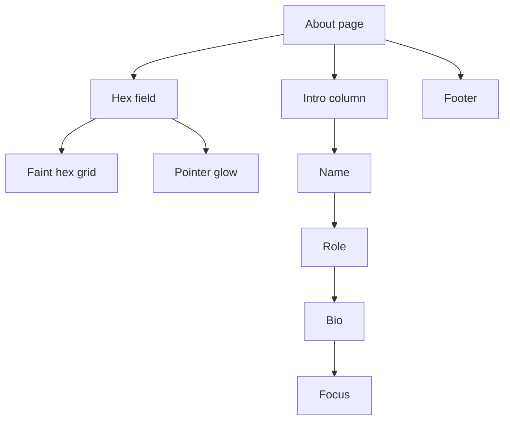
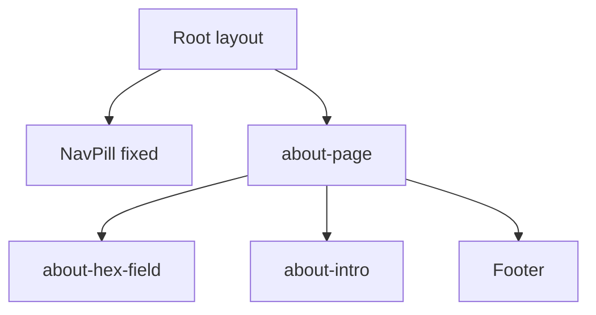

# About, section by section

中文版：[tron-about.zh.md](./tron-about.zh.md)

The page at `/about` is a short bio. It is not part of the home scroll film, and it is not the gallery. The gallery stays at `/work`.

Code lives in `app/about/page.tsx`. The hex field styles live in `components/home/tron.css`, next to the home scene styles, because About reuses the Legacy cyan tokens and the archived hero name.

## The idea

About is a still page. There is no pin and no scrub. The header is the same bar as the rest of the site, drawn by the root layout, outside this page.

The picture is Legacy cyan on a quiet ground. A faint hex field sits behind the type. Moving the pointer lights the hex strokes in a small circle, then they fade when the pointer leaves. The type stays in front of that field.

## Color and type

About sets its own Legacy tokens. It does not take the Ares red from the lower half of the home film.

| Token | Value | Where it shows |
| --- | --- | --- |
| `--tron` | `#5ce1ff` | Hex strokes, the name glow, the role in dark mode |
| `--ember` | `#b8f4ff` | The role line in dark mode |

The page ground is `#eeeeee` in light mode and `#0d0d0d` in dark mode. About follows `next-themes`. The home page does not.

The name and the role use Oxanium, loaded on this page as `--font-display`. The bio, the Focus list, and the footer stay in Inter, the site body face.

## How the page is wrapped

`main` is at least one viewport tall, with `pt-28` so the first line clears the fixed header, and `px-6` (`sm:px-10`) at the sides. The intro and the footer are the same centered column, `max-w-2xl`.

The hex field is `position: absolute; inset: 0` and `pointer-events: none`. It covers the page and does not catch clicks. The intro and the footer are `relative z-10`, so the type sits on top of the hexes.

---

## 1. Hex field

File: `app/about/page.tsx`, styles in `components/home/tron.css`, glow in `components/about/AboutHexGlow.tsx`

Two layers share one tile. The tile is 56 by 48, two pointy hexes, the usual honeycomb step. Both layers are pulled out by `-4rem` so the pattern does not end in a hard edge at the page box.

**Faint grid.** `.about-hex-grid` draws the tile in cyan strokes (`stroke-width: 0.6`). Opacity is `0.14` in light mode and `0.22` in dark mode. A radial mask centered at `70% 20%` fades the field out by `68%`, so the hexes pool toward the upper right and the corners stay empty.

**Pointer glow.** `.about-hex-glow` uses the same tile, with a thicker cyan stroke (`stroke-width: 1.15`) and a short cyan drop shadow. It starts at `opacity: 0`. A mask is a circle 140px across, centered on `--hx` and `--hy`.

`AboutHexGlow` is a client component. On `pointermove` over `.about-page` it writes those two variables from the pointer, sets `data-lit="true"`, and the layer fades to `opacity: 0.95` over `0.45s`. On `pointerleave` it clears `data-lit` and the glow fades back out. The listener is on the page, not on the field, because the field does not receive pointer events.

When the visitor has asked for reduced motion, the effect does not attach, and CSS sets `.about-hex-glow` to `display: none`.

**Archived scan.** A horizontal light band is kept in `components/archive/about/hex-scan.css`, with the markup hook in `components/archive/about/AboutHexScan.tsx`. It is not on the page. The band was a 20rem-tall white wash plus white hex strokes on the same 56×48 tile. `mask-position` carried it from below the field up to the header in 10 seconds. Reduced motion turned it off.

## 2. Name and role

The name and the role are the v1 hero pieces, kept in `components/archive/home/HeroName.tsx` and `components/archive/home/HeroRole.tsx`. The live hero does not mount them. About does.

- **Name** is `site.fullName`, "Alex Woon Jun Rong", in an `h1`. On this page it is left-aligned, `clamp(2.4rem, 7vw, 3.6rem)`, Oxanium, and not uppercased. Light mode paints it `#111` with a soft cyan shadow. Dark mode paints it `#f4feff` with a wider cyan glow.
- **Role** is `Full Stack Developer · Malaysia`, from `site.role` and `site.location`. Uppercase, tracked out, Oxanium. Light mode mixes `#5ce1ff` toward `#333`. Dark mode mixes `--ember` toward white.

The role still carries `data-lag="0.45"` from the hero. About has no ScrollSmoother, so that attribute does nothing here.

## 3. Bio

Two paragraphs, `text-base` / `leading-7`, `#444` in light mode and `#ccc` in dark mode. The first is the gallery line: games, 3D sketches, and web apps, mostly Phaser, Three.js, React, and Next.js. The second is `site.education`, badminton, and the GitHub name `site.githubUser` (`noowxela`), linked to `site.github`.

## 4. Focus

The heading is the small tracked label `Focus`. The list is `site.highlights`:

- Phaser 2 & 3 game collections
- Three.js and interactive WebGL
- Next.js apps, UI kits, and small tools

Each row has a 4px dot in `#888`.

## 5. Footer

A top rule, then three columns. The rule is `border-black/10` in light mode and `border-white/10` in dark mode. Column labels use the same tracked style as Focus.

| Column | What it shows |
| --- | --- |
| Contact | `site.email`, `alexwoon.jhb@gmail.com`, as a `mailto` link. The label is the address. |
| Social | GitHub and LinkedIn, from `site.github` and `site.linkedin`. Both open in a new tab. |
| Others | Resume (`site.resume`, new tab) and Gallery (`/work`). |

The header Email item, the home exit Email link, and this footer column all use `site.email`.

## What stays still on purpose

- The whole page. Nothing is pinned, scrubbed, or parallaxed.
- The faint hex grid. Only the pointer glow moves, and only while the pointer is on the page.
- The header. It is the root layout, not part of this file.

## Light versus dark

| | Light | Dark |
| --- | --- | --- |
| Ground | `#eeeeee` | `#0d0d0d` |
| Name | `#111`, soft cyan shadow | `#f4feff`, wider cyan glow |
| Role | Cyan mixed toward `#333` | Ember mixed toward white |
| Body copy | `#444` | `#ccc` |
| Hex grid | Opacity `0.14` | Opacity `0.22` |
| Pointer glow | Same cyan stroke. Hidden when reduced motion is on. | Same |
