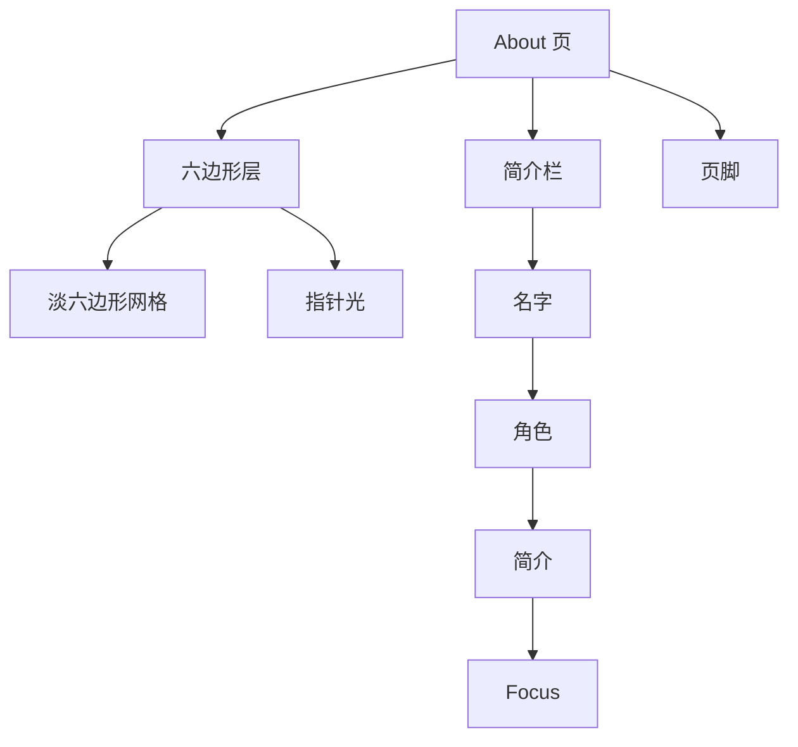
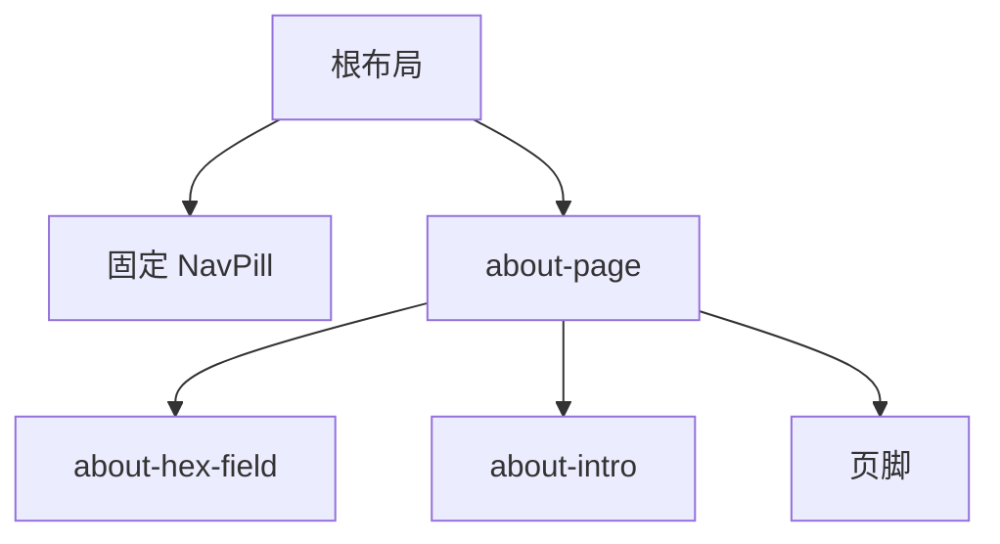

# About 页，逐段说明

英文版：[tron-about.md](./tron-about.md)

`/about` 是一篇短简介。它不属于首页的滚动短片，也不是画廊。画廊仍在 `/work`。

代码在 `app/about/page.tsx`。六边形的样式在 `components/home/tron.css`，和首页场景写在一起，因为 About 沿用 Legacy 的青色，也沿用归档下来的英雄区名字。

## 想法

About 是静止的一页。没有钉住，也没有跟手scrub。顶栏和站点其他页面是同一条，由根布局绘制，不在这一页里面。

画面是安静底色上的 Legacy 青色。一层很淡的六边形铺在文字后面。指针移动时，一小圈六边形描边会亮起来；指针离开，光就淡回去。文字始终在这层前面。

## 颜色和字体

About 用自己的 Legacy 变量。它不接首页下半段的 Ares 红。

| 变量 | 值 | 出现在哪里 |
| --- | --- | --- |
| `--tron` | `#5ce1ff` | 六边形描边、名字的光、深色模式下的角色行 |
| `--ember` | `#b8f4ff` | 深色模式下的角色行 |

页面底色浅色是 `#eeeeee`，深色是 `#0d0d0d`。About 跟随 `next-themes`。首页不跟随。

名字和角色用 Oxanium，这一页把它载成 `--font-display`。简介、Focus 列表和页脚仍用站点正文 Inter。

## 页面怎么包起来

`main` 至少一屏高。`pt-28` 让第一行躲开固定顶栏。左右是 `px-6`（`sm:px-10`）。简介和页脚是同一条居中栏，`max-w-2xl`。

六边形层是 `position: absolute; inset: 0`，并且 `pointer-events: none`。它盖住整页，不接收点击。简介和页脚是 `relative z-10`，所以文字在六边形上面。

---

## 1. 六边形层

文件：`app/about/page.tsx`。样式在 `components/home/tron.css`。指针光在 `components/about/AboutHexGlow.tsx`。

两层共用一块砖。砖是 56×48，两枚尖顶六边形，普通蜂窝错位。两层都向外扩 `-4rem`，图案不会在页面盒子边上突然切断。

**淡网格。** `.about-hex-grid` 用青色描边画这块砖（`stroke-width: 0.6`）。浅色透明度 `0.14`，深色 `0.22`。径向遮罩中心在 `70% 20%`，到 `68%` 淡出，所以六边形聚在右上，四角是空的。

**指针光。** `.about-hex-glow` 用同一块砖，描边更粗（`stroke-width: 1.15`），再加一圈很短的青色投影。一开始 `opacity: 0`。遮罩是直径 140px 的圆，圆心是 `--hx` 和 `--hy`。

`AboutHexGlow` 是客户端组件。指针在 `.about-page` 上移动时，它把这两个变量写成指针位置，设上 `data-lit="true"`，这一层用 `0.45s` 淡到 `opacity: 0.95`。指针离开页面就清掉 `data-lit`，光淡回去。监听绑在页面上，不绑在六边形层上，因为那一层不接收指针。

访客开了减少动态效果时，这段监听不会挂上，CSS 把 `.about-hex-glow` 设成 `display: none`。

**归档的扫描光。** 一条横向光带留在 `components/archive/about/hex-scan.css`，标记钩子在 `components/archive/about/AboutHexScan.tsx`。它不在页面上。光带是 20rem 高的白雾，加上同一块 56×48 砖上的白色六边形描边。`mask-position` 用 10 秒把它从页面下方送到顶栏。减少动态效果时它关掉。

## 2. 名字和角色

名字和角色是英雄区第一版，留在 `components/archive/home/HeroName.tsx` 和 `components/archive/home/HeroRole.tsx`。现在的英雄区不挂它们。About 挂。

- **名字** 是 `site.fullName`，「Alex Woon Jun Rong」，放在 `h1` 里。这一页左对齐，`clamp(2.4rem, 7vw, 3.6rem)`，Oxanium，不全大写。浅色是 `#111`，带一层柔的青色阴影。深色是 `#f4feff`，青色光更开。
- **角色** 是 `Full Stack Developer · Malaysia`，来自 `site.role` 和 `site.location`。全大写、字距拉开、Oxanium。浅色把 `#5ce1ff` 混向 `#333`。深色把 `--ember` 混向白。

角色上还留着英雄区的 `data-lag="0.45"`。About 没有 ScrollSmoother，这个属性在这里不起作用。

## 3. 简介

两段，`text-base` / `leading-7`。浅色 `#444`，深色 `#ccc`。第一段是画廊那句：游戏、3D 草图和网页应用，主要是 Phaser、Three.js、React 和 Next.js。第二段是 `site.education`、羽毛球，以及 GitHub 名 `site.githubUser`（`noowxela`），链到 `site.github`。

## 4. Focus

标题是小号、拉开字距的 `Focus`。列表是 `site.highlights`：

- Phaser 2 & 3 game collections
- Three.js and interactive WebGL
- Next.js apps, UI kits, and small tools

每一行前面有一颗 `#888` 的 4px 圆点。

## 5. 页脚

一条顶部分隔线，然后三列。浅色线是 `border-black/10`，深色是 `border-white/10`。列标题和 Focus 同一套字距。

| 列 | 内容 |
| --- | --- |
| Contact | `site.email`，`alexwoon.jhb@gmail.com`，`mailto` 这个地址。链接文字就是地址本身。 |
| Social | GitHub 和 LinkedIn，来自 `site.github` 和 `site.linkedin`。都在新标签打开。 |
| Others | Resume（`site.resume`，新标签）和 Gallery（`/work`）。 |

顶栏的 Email、首页出口的 Email，以及页脚这一列，都用 `site.email`。

## 故意不动的部分

- 整页。没有钉住、scrub，也没有视差。
- 淡六边形网格。只有指针光会动，而且只在指针还在这一页上的时候。
- 顶栏。它属于根布局，不属于这个文件。

## 浅色和深色

| | 浅色 | 深色 |
| --- | --- | --- |
| 底 | `#eeeeee` | `#0d0d0d` |
| 名字 | `#111`，柔的青色阴影 | `#f4feff`，更开的青色光 |
| 角色 | 青色混向 `#333` | Ember 混向白 |
| 正文 | `#444` | `#ccc` |
| 六边形网格 | 透明度 `0.14` | 透明度 `0.22` |
| 指针光 | 同一套青色描边。减少动态效果时隐藏。 | 相同 |
