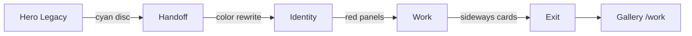
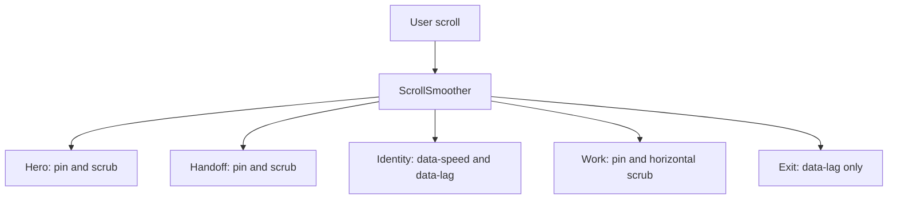
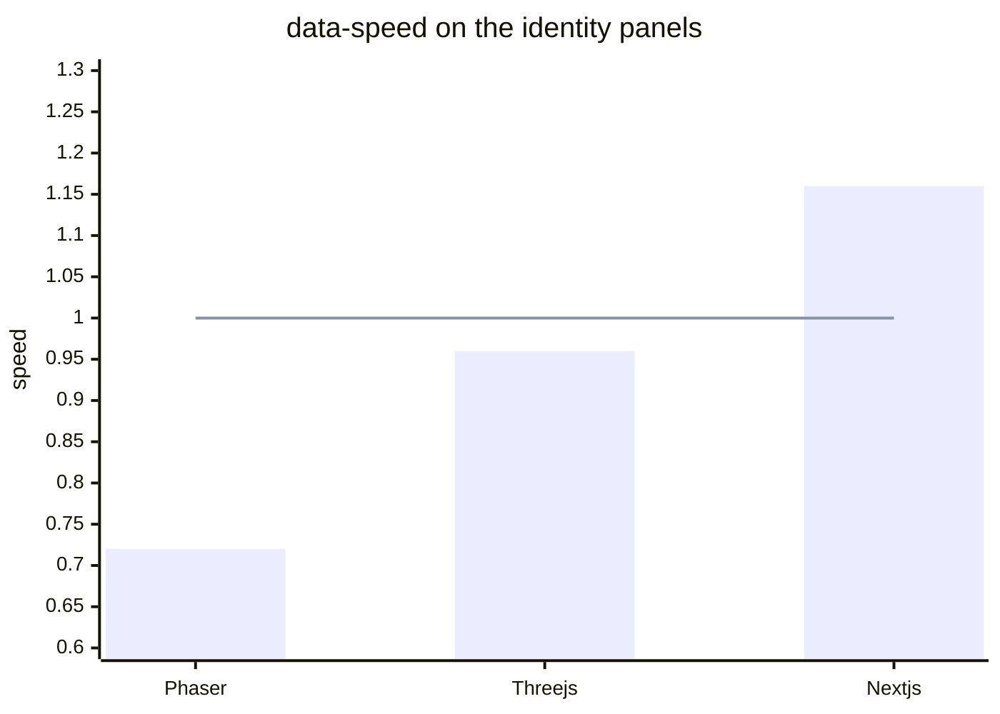
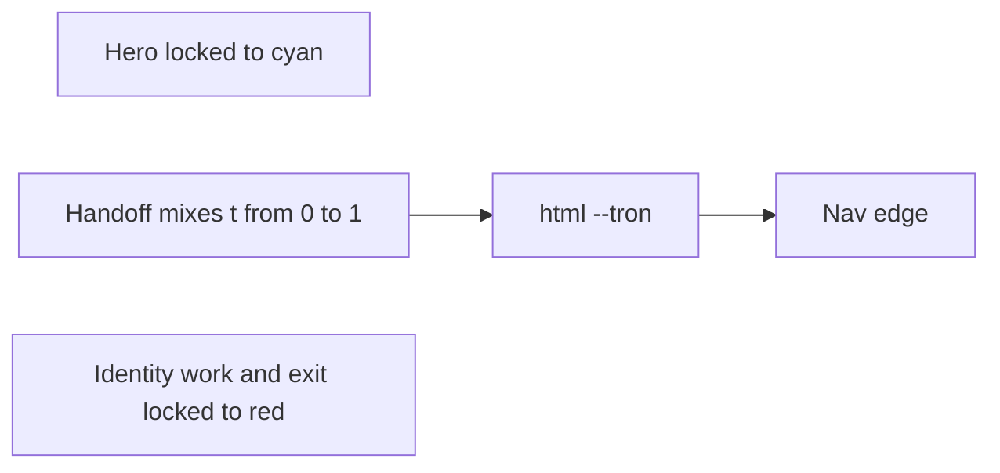
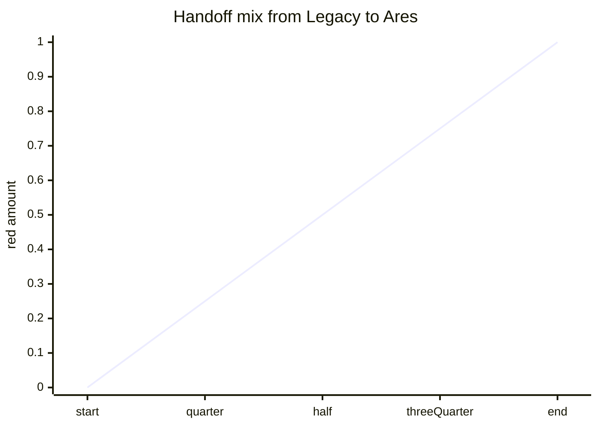
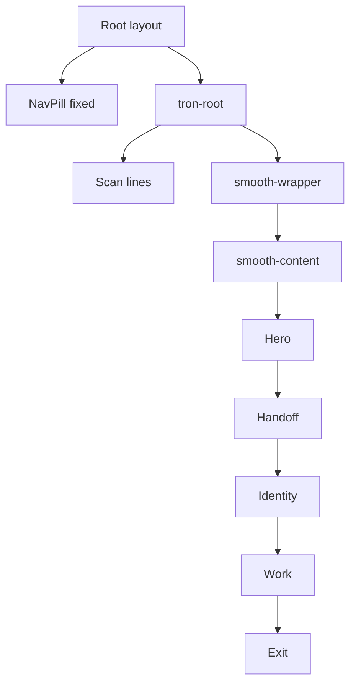
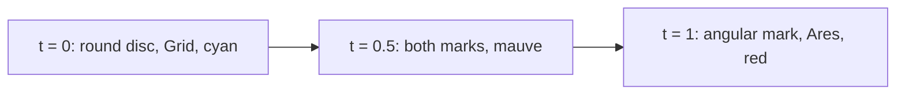
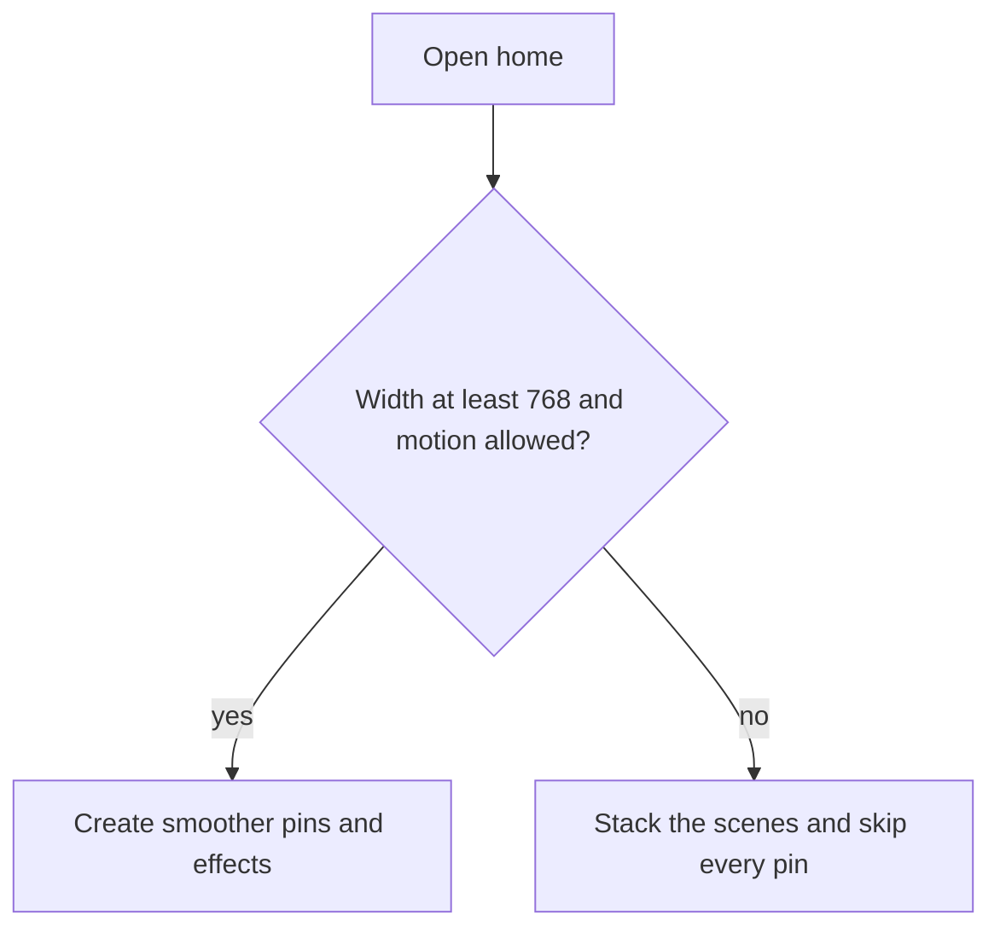
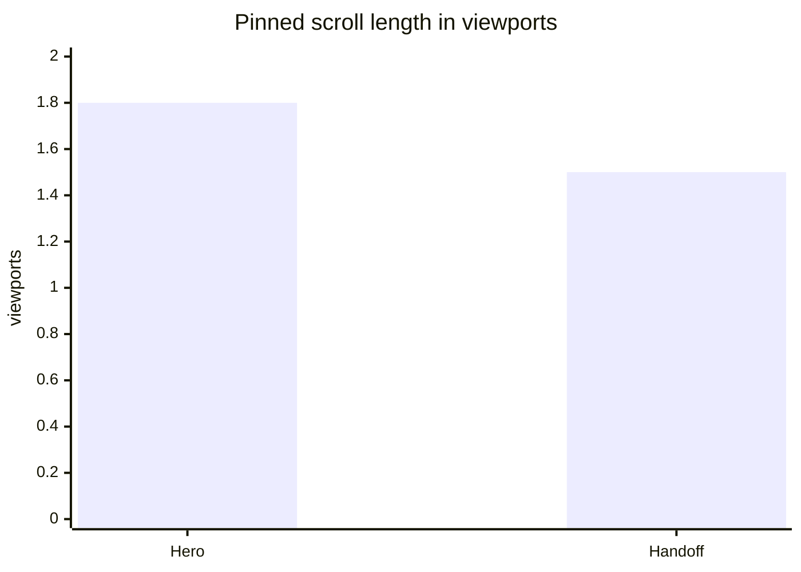

# Tron home, section by section

中文版：[tron-home.zh.md](./tron-home.zh.md)

The page at `/` is a short film made of five scenes. It is not the project gallery. The gallery stays at `/work`.

The story is the two Tron films in order:

1. **Tron: Legacy** is the top of the page. Cool cyan, round identity disc, the Grid.
2. **The handoff** is the scroll that rewrites that world.
3. **Tron: Ares** is everything after. Hot red, an angular mark, the work and the exit.

Code lives in `components/home/`. `app/page.tsx` only loads the fonts and the three demos marked `featured: true`.

## The idea behind the motion

Scroll is the timeline. You do not press play. Moving the page moves the picture, and scrolling back rewinds it.

Three GSAP tools do that, and they do different jobs:

| Tool               | What it feels like                                                                                                                                                                                           | Where it is used                   |
| ------------------ | ------------------------------------------------------------------------------------------------------------------------------------------------------------------------------------------------------------ | ---------------------------------- |
| **ScrollSmoother** | The page glides instead of stepping with the trackpad. `smooth: 1.2`.                                                                                                                                        | The whole home page, desktop only. |
| **Pin**            | A scene sticks to the screen while you keep scrolling. The rest of the page waits.                                                                                                                           | Hero, handoff, and the work track. |
| **Scrub**          | Scroll position *is* the animation progress. There is no separate timer. `scrub: 0.8` on the hero and handoff means the picture trails the scroll by a fraction of a second. The work track uses `scrub: 1`. | Same three scenes.                 |

`effects: true` on the smoother is the data-attribute system. You do not write a parallax function. You mark an element:

- `data-speed` is parallax. `1` matches normal scroll. Below `1` lags behind, like a distant layer. Above `1` moves faster, like something close to the camera.
- `data-lag` is trailing. The number is seconds of delay. The element catches up after the scroll moves, so type and panels feel like they have weight.

Those attributes do nothing until the smoother exists. On a phone, and when the visitor has asked for reduced motion, the markup stays and the motion does not run.

`data-speed` against a normal scroll of `1`. Below the line the layer hangs back. Above it, the layer rushes ahead.

## One color, the whole film

Almost every glow, rule, grid line, and label reads a CSS variable named `--tron`. A second token, `--ember`, is the hotter edge of the same light.

| Moment | `--tron`       | `--ember`            |
| ------ | -------------- | -------------------- |
| Legacy | `#5ce1ff` cyan | `#b8f4ff` white-blue |
| Ares   | `#ff2b2b` red  | `#ff6a2c` ember      |

The hero section sets cyan on itself, so it stays Legacy even while the rest of the page turns red. Identity, work, and exit set red on themselves. Only the handoff scene and the header change color *during* the scroll. The handoff timeline mixes the two hex colors and writes the result onto the handoff section and onto `html`. The header lives outside the scroll wrapper, so it can only follow the token on `html`.

The void behind everything is `#050507`. The page does not follow the site's light theme. Gallery and About still do.

## Shared pieces

These show up in more than one scene. They are in `tron.css` and `discs.tsx`.

**Perspective grid.** A floor of hairline cells, faded out at the top so it reads as a horizon. On the hero it fills the bottom 69% of the section and stays tilted at 80 degrees. Scroll scales and lifts that floor, so the Grid recedes. On the handoff and the exit, the floor stays at `rotateX(68deg)` and just takes the current `--tron`.

**Light ribbon.** A thin horizontal beam. Its color is a gradient from `--tron` to `--ember`, so it heats up when the token changes. The hero beam is kept in `components/archive/home/HeroRibbon.tsx` and is not on the page. On the handoff it still grows from a short streak to a full beam.

**Frame.** A hairline rectangle inset from the edges, with two corner brackets. It is the HUD bezel, not a card. The hero does not use it. Handoff, identity, work, and exit still do.

**Scan lines.** A fixed overlay of faint horizontal bars (`tron-scan`) sits above the scenes and below the nav. It is hidden when reduced motion is on. It does not block clicks.

**HUD type.** Small labels use Share Tech Mono, wide tracking, uppercase. The hero label `01 // The Grid` is kept in `components/archive/home/HeroHud.tsx` and is not on the page. Later scenes still use the same face, such as `02 // Ares`. Display type uses Oxanium. The rest of the site still uses Inter.

**Identity disc vs Ares mark.** `LegacyDisc` is concentric circles and tick marks, the round disc from the Grid. `AresMark` is nested diamonds and a cross, the angular program sigil. Both are stroked with `currentColor`, so they inherit `--tron`.

## How the page is wrapped

The header is rendered by the root layout, *outside* this tree. ScrollSmoother breaks `position: fixed` on elements inside the moving content. The header has to stay outside, which is why it already lives in `app/layout.tsx`.

While the home page is mounted, `html` gets the class `tron-home` and `scroll-behavior: auto`. The site otherwise uses CSS smooth scrolling, and that fights the smoother.

---

## 1. Hero — Legacy

File: `components/home/HeroScene.tsx`

This is the poster. Full viewport, pinned for about two extra screens of scroll (`end: '+=180%'`). The name is off the poster for now, and the scene frame is not on this section. Scroll pushes the world.

What moves together, on one scrubbed timeline:

- **Grid floor** fills the bottom 69% of the hero and stays tilted at 80 degrees. It scales from `1.05` to `1.5` while shifting up. The horizon pulls away. The tilt lives in the tween, not only in CSS, because GSAP would otherwise replace the CSS transform and the floor would go flat. Phones and reduced motion keep the same 80 degree tilt from CSS.
- **Disc v2** sits centered under the scroll meter and rotates from -10 degrees to 32. It is the same ring disc as v1, at HUD size. The centered v1 disc is kept in `components/archive/home/CenteredDisc.tsx` and is not on the page.
- **Name** (`site.name`, "Alex Woon") is kept in `components/archive/home/HeroName.tsx` and is not on the page. When it was centered, it drifted from 16px down to 8px up.
- **Role** (`Full Stack Developer · Malaysia`) is kept in `components/archive/home/HeroRole.tsx` and is not on the page. It had `data-lag="0.45"` so it trailed the scroll.
- **Ribbon** is kept in `components/archive/home/HeroRibbon.tsx` and is not on the page. It slid in from the left and grew from 30% width to full width.
- **Corner label** (`01 // The Grid`) is kept in `components/archive/home/HeroHud.tsx` and is not on the page. It had `data-speed="0.9"` and `data-lag="0.25"`, so it sat slightly off the scroll and trailed. It lived below the header so it did not slide under the bar.
- **Scroll meter** is the thin vertical line at the bottom. It scales from a stub to full height. It is a progress mark for this pin, not a control.

The hero has no "Legacy" label. The section's own `--tron` is cyan, so this scene does not turn red when the handoff later recolors the page.

**Dome light.** Kept in `components/archive/home/HeroDome.tsx` and not on the page. The round glow was not a mesh and not the disc. Two cyan radial gradients stacked where the name used to sit. `.hero-dome-wash` paints an ellipse at `50% 42%`, `--tron` at 16% strength, fading out by 52%. `.hero-glow` covers the scene with a second ellipse at `50% 46%`, 18% strength, fading out by 58%. It sat above the grid (`z-index: 1`) and did not catch clicks. Together they read as one dome, the backlight for the centered name and the old disc.

**Mist.** Sixteen soft patches live inside the grid floor, so they tilt and recede with it. Each patch travels down the plane, from the horizon toward the camera, which is what makes the floor feel filled in. Far patches start nearer the horizon and stay quieter. Near patches travel farther down the floor and stay brighter. Reduced motion leaves them still.

## 2. Handoff — the rewrite

File: `components/home/HandoffScene.tsx`

This scene has no biography. Its only job is to change the film. It pins for about one and a half screens (`end: '+=150%'`).

Everything in the timeline shares the same progress, `t`, from 0 to 1:

- `--tron` and `--ember` interpolate from the Legacy pair to the Ares pair. The handoff section uses that color for its grid, glow, disc, and ribbon. `html` gets the same values so the nav edge turns with the scroll.
- The round disc fades, scales up to `1.42`, and rotates 26 degrees, like it is derezzing.
- The angular mark fades in from `0.6` scale and a -22 degree twist to full size and upright.
- The word "Grid" fades up and out. "Ares" fades up into the same slot. At the halfway point both words are half visible, so the type looks ghosted. At the end only "Ares" remains.
- The ribbon grows from 18% width to full width, and its gradient heats up because it uses the changing tokens.

"System rewrite" stays put. It is the only caption, and it is not a bio.

Scrolling back runs the same timeline in reverse. The page returns to cyan, the disc becomes round again, and the label returns to Grid.

**Without the pin** (phone, or reduced motion) both marks and both words are visible at once. The round disc and "Grid" are faded to about a third opacity. The handoff grid is drawn with cyan horizontal lines and red vertical lines, so the color change still reads as a band instead of a scrub. A scroll listener flips the nav token when the handoff section crosses roughly 42% of the screen. That is a cut, not a mix.

## 3. Identity — Ares

File: `components/home/IdentityScene.tsx`

The film has changed. This scene introduces the person, still in the red world. It is not pinned. Parallax needs the section to travel through the viewport, so pin would fight it.

Copy comes from `data/site.ts`:

- HUD: `02 // Ares`, with `data-lag="0.2"`.
- Name: `site.fullName`, with `data-speed="0.88"`, so the heading drifts a little slower than the scroll.
- Tagline, with `data-lag="0.4"`.
- Education, unmoved, so there is a still line to read against the drifting ones.

The three focus lines are panels. Each one has its own speed and lag, so they separate as you scroll:

| Panel                                  | `data-speed` | `data-lag` | Feel                                 |
| -------------------------------------- | ------------ | ---------- | ------------------------------------ |
| Phaser 2 & 3 game collections          | `0.72`       | `0.16`     | Farther back, a short trail          |
| Three.js and interactive WebGL         | `0.96`       | `0.36`     | Almost with the page, a longer trail |
| Next.js apps, UI kits, and small tools | `1.16`       | `0.52`     | Closer, the heaviest trail           |

From 900px wide, the name sits in the left column and the panels in the right. Below that they stack. The panels are sharp, with corner ticks, not the rounded pills used on About.

## 4. Work — the horizontal track

File: `components/home/WorkScene.tsx`

Three projects, pinned, scrubbed sideways. The section sticks. The heading "Work" stays on the left. The card row (`data-work="track"`) translates on `x` by its own overflow: the distance is the track width minus the window width. Scroll distance equals that pixel distance, so the last card can reach the viewport. `invalidateOnRefresh` recalculates that distance after a resize or after fonts load.

If the overflow is under 24px, the pin is skipped. That avoids a pin that traps the page when the cards already fit.

The cards are whichever demos have `featured: true`, in gallery order:

1. Phaser Examples
2. My Reborn Car
3. Interactive Experiences

Every card links to `/work`, the full gallery. They do not deep-link to a single demo. The thumb, name, and blurb come from `data/demos.ts`.

Each card also has a slight speed and a longer trail than the one before it:

| Card | `data-speed` | `data-lag` |
| ---- | ------------ | ---------- |
| 01   | `0.94`       | `0.18`     |
| 02   | `1`          | `0.34`     |
| 03   | `1.06`       | `0.5`      |

Speeds stay close to `1` because these cards are inside a pin. A strong `data-speed` would throw them up or down while the row is also sliding sideways.

On a phone the row becomes a column, the section grows with the cards, and there is no pin.

## 5. Exit — signal

File: `components/home/ExitScene.tsx`

The last scene is a red horizon and a way out. It is not pinned. The grid floor sits low, like the Grid closing.

- `04 // Signal` trails with `data-lag="0.45"`.
- "Enter the gallery" is the heading and the button. Both go to `/work` for the button. The heading is text.
- The role and location trail with `data-lag="0.3"`.
- Email, GitHub, LinkedIn, and Resume are the same destinations as the rest of the site, from `data/site.ts`.

The button is a sharp outline in `--tron`, not a pill. That keeps the exit in the film. The header above it stays the site's chrome.

## What stays still on purpose

- The nav links, theme toggle, and social icons. Only the header's edge color changes.
- Education on the identity scene, and "System rewrite" on the handoff.
- The scan lines and the frame.
- The gallery at `/work` and the About page. They never enter the smoother.

## Desktop versus the fallback

|                           | Desktop, motion allowed             | Phone, or reduced motion                                        |
| ------------------------- | ----------------------------------- | --------------------------------------------------------------- |
| Scroll                    | ScrollSmoother, `smooth: 1.2`       | Native scroll                                                   |
| Hero, handoff, work       | Pinned and scrubbed                 | Stacked, no pin                                                 |
| `data-speed` / `data-lag` | Active                              | Present in the HTML, ignored                                    |
| Color change              | Mixed frame by frame on the handoff | A static split grid, then a cut on the nav when the band passes |
| Handoff marks             | Crossfade                           | Both visible, Legacy faded                                      |

The switch is `gsap.matchMedia` in `useHomeScroll.ts`. Crossing 768px, or toggling reduced motion, kills the smoother and the pins, or builds them again. Resize also calls `ScrollTrigger.refresh()` so a pin does not stay stuck at the old size.

How far you scroll while a scene is stuck, in viewports. The work pin length depends on how wide the three cards are.

