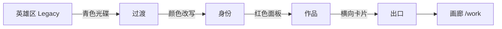
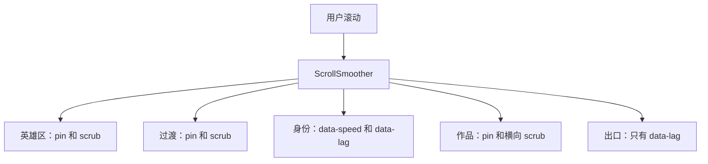
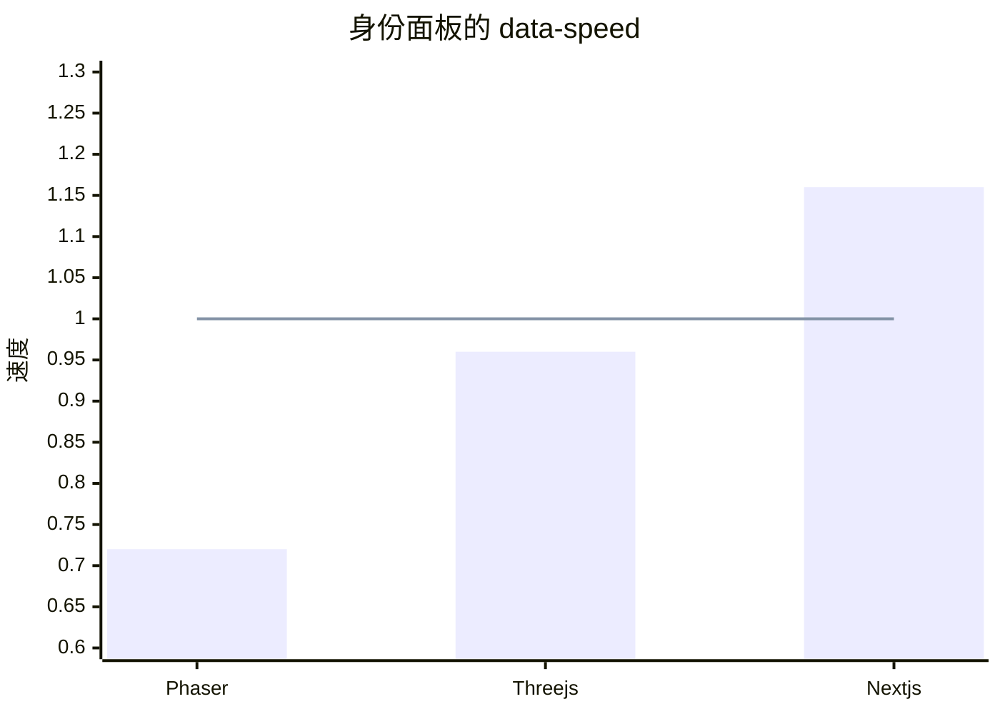
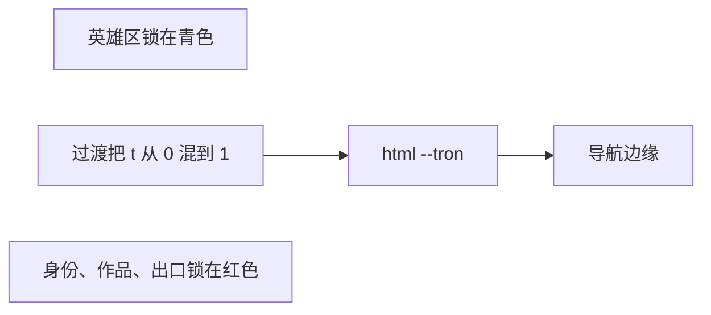
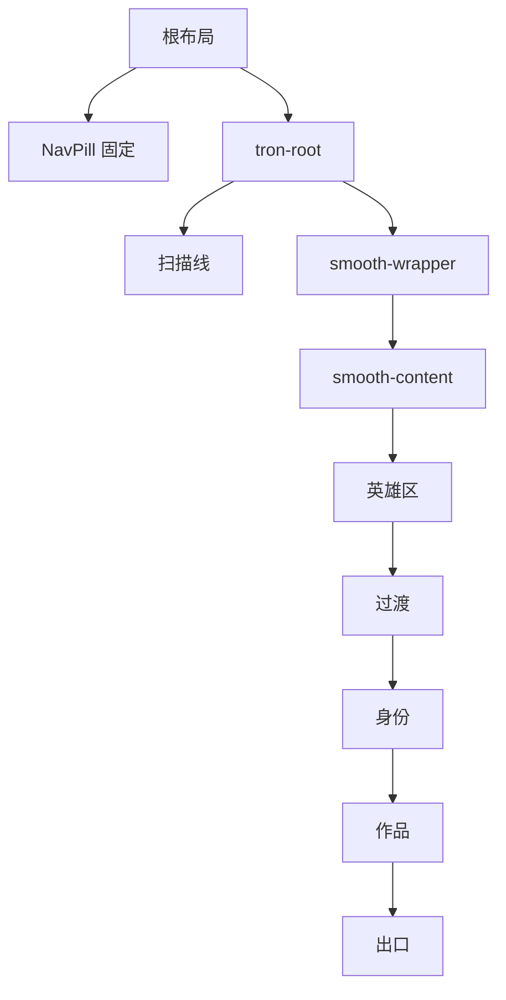
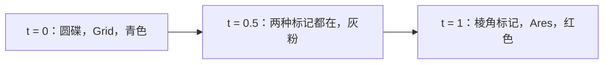
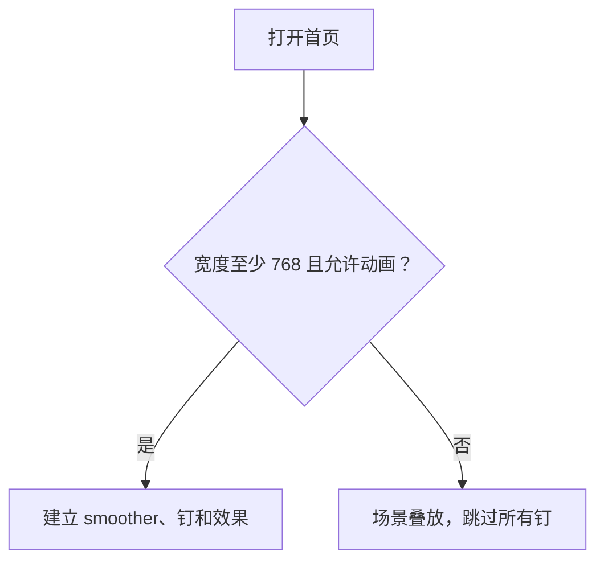

# Tron 首页，逐段说明

英文版：[tron-home.md](./tron-home.md)

`/` 是一部五段的短片，不是项目画廊。画廊仍在 `/work`。

故事按两部 Tron 电影的顺序：

1. **Tron: Legacy** 在页面上方。冷青色、圆形身份光碟、Grid。
2. **过渡** 是一段滚动，把这个世界改写掉。
3. **Tron: Ares** 是后面的全部。热红色、棱角标记、作品和出口。

代码在 `components/home/`。`app/page.tsx` 只负责加载字体，以及三个标了 `featured: true` 的 demo。



## 动效的想法

滚动就是时间轴。没有播放键。页面向下走，画面就往前走；往回滚，画面就倒放。

三件 GSAP 工具各做一件事：

| 工具 | 看起来像什么 | 用在哪里 |
| --- | --- | --- |
| **ScrollSmoother** | 页面是滑过去的，不是跟触控板一格一格跳。`smooth: 1.2`。 | 整个首页，仅桌面。 |
| **Pin** | 某一段钉在屏幕上，你继续滚，页面其余部分先等着。 | 英雄区、过渡、作品轨道。 |
| **Scrub** | 滚动位置就是动画进度，没有另外的计时器。英雄区和过渡的 `scrub: 0.8` 表示画面比滚动晚一点点。作品轨道用 `scrub: 1`。 | 同样这三段。 |

Smoother 上的 `effects: true` 就是数据属性系统。不用自己写视差函数，给元素加上属性即可：

- `data-speed` 是视差。`1` 跟正常滚动一样。小于 `1` 落在后面，像更远的一层。大于 `1` 走得更快，像离镜头更近。
- `data-lag` 是拖尾。数字是延迟的秒数。滚动先动，元素再追上来，字和面板就有重量。

这些属性在 smoother 出现之前什么都不做。手机上，以及访客要求减少动态效果时，标记还在，动画不跑。



`data-speed` 对照正常滚动的 `1`。线以下，这一层落在后面。线以上，这一层抢在前面。



## 一种颜色，整部片子

几乎所有发光、边线、网格和标签都读一个叫 `--tron` 的 CSS 变量。第二个变量 `--ember` 是同一束光更热的边缘。

| 时刻 | `--tron` | `--ember` |
| --- | --- | --- |
| Legacy | `#5ce1ff` 青 | `#b8f4ff` 白蓝 |
| Ares | `#ff2b2b` 红 | `#ff6a2c` 余烬 |

英雄区自己写成青色，所以页面其余部分变红时，它仍是 Legacy。身份、作品、出口自己写成红色。只有过渡场景和顶栏会在滚动过程中变色。过渡的时间轴把两个十六进制颜色混在一起，写到过渡这一段，也写到 `html`。顶栏在滚动容器外面，所以它只能跟着 `html` 上的变量。

所有东西后面的虚空是 `#050507`。这一页不跟站点的浅色主题走。画廊和 About 仍然跟着。



```mermaid
xychart-beta
  title "过渡从 Legacy 混到 Ares"
  x-axis [起点, 四分之一, 一半, 四分之三, 终点]
  y-axis "红色占比" 0 --> 1
  line [0, 0.25, 0.5, 0.75, 1]
```

## 共用的零件

这些会出现在不止一段里。它们在 `tron.css` 和 `discs.tsx`。

**透视网格。** 一层细线格子，顶部淡出，看起来像地平线。英雄区里它占这一段底部的 69%，保持 80 度倾斜。滚动会放大并抬起这块地面，Grid 就往后退。过渡和出口里，地面仍是 `rotateX(68deg)`，只吃当前的 `--tron`。

**光带。** 一条很细的横光束。颜色是从 `--tron` 到 `--ember` 的渐变，所以变量一变，它就变热。英雄区的光带留在 `components/archive/home/HeroRibbon.tsx`，不出现在页面上。过渡里它仍从一小截长成一整条。

**边框。** 离边缘缩进一圈的细线矩形，带两个角括号。这是界面的视镜框，不是卡片。

**扫描线。** 一层固定的淡横条（`tron-scan`），在场景上面、导航下面。减少动态效果时隐藏。不挡住点击。

**界面字体。** 小标签用 Share Tech Mono，字距很宽，全大写：`01 // The Grid`。展示标题用 Oxanium。站点其余地方仍用 Inter。

**身份光碟和 Ares 标记。** `LegacyDisc` 是同心圆和刻度，Grid 上的圆碟。`AresMark` 是嵌套菱形加一个十字，棱角的程序印记。两者都用 `currentColor` 描边，所以继承 `--tron`。

## 页面怎么包起来



顶栏由根布局渲染，在这棵树的外面。ScrollSmoother 会弄坏移动内容里面的 `position: fixed`。顶栏必须留在外面，所以它本来就在 `app/layout.tsx`。

首页挂上时，`html` 会加上 `tron-home`，并把 `scroll-behavior` 设成 `auto`。站点其他地方用 CSS 平滑滚动，那会跟 smoother 打架。

---

## 1. 英雄区 — Legacy

文件：`components/home/HeroScene.tsx`

这是海报。整屏视口，钉住大约额外两屏的滚动（`end: '+=180%'`）。名字先从海报上拿掉。滚动推动这个世界。

同一条被 scrub 的时间轴上，这些一起动：

- **网格地面**占英雄区底部的 69%，保持 80 度倾斜，从 `1.05` 放大到 `1.5`，同时往上移。地平线拉开。倾斜写在补间里，不只写在 CSS 里，因为 GSAP 会换掉 CSS 的 transform，地面就会变平。手机和减少动态效果时，CSS 里的 80 度仍然在。
- **光碟 v2** 在 `01 // The Grid` 右侧，从 -10 度转到 32 度。它和 v1 是同一套圆环，只是收成界面尺寸。居中的 v1 光碟留在 `components/archive/home/CenteredDisc.tsx`，不出现在页面上。
- **名字**（`site.name`，"Alex Woon"）留在 `components/archive/home/HeroName.tsx`，不出现在页面上。它居中时，从下移 16px 漂到上移 8px。
- **角色行** `Full Stack Developer · Malaysia` 留在 `components/archive/home/HeroRole.tsx`，不出现在页面上。它原来有 `data-lag="0.45"`，拖在滚动后面。
- **光带**留在 `components/archive/home/HeroRibbon.tsx`，不出现在页面上。它原来从左边滑入，宽度从 30% 长到满宽。
- **马赛克名字**（`HeroMosaic.tsx`、`mosaicScene.ts`）不在滚动时间轴上。它停在英雄区往下 48% 的位置，宽约 620px，车道在这里还看得见。网格坑的顶边更高，但遮罩会在那之前把地面淡掉，所以 48% 才是车道的尽头。在英雄区的钉住滚动里，它跟着地面一起动：名字上升地面高度的 24%（和地平线同一段路程），缩放从 1 到 0.62。手机和减少动态效果时停在这个静止位置。它是一个由青色短横条组成的小 Three.js 物体：正面是 "alex woon"，背面是 "noowxela"。每一层都是先把文字画到离屏 canvas，再采样成网格，每层一个 `InstancedMesh`。背面那层是镜像排的，所以从背后看是正的。鼠标悬停不会转动物体：指针投影到当前朝外的那一面，附近几格的砖块会朝观看者凸出并变亮，指针离开后再缩回去。舞台本身约 4.5 秒上下漂 10px，名字看起来可以拿起来。没有「拖动旋转」的提示字。按住拖动会停住这股漂浮（手机上左右滑）并转动它；松手后漂浮恢复，转动会惯性滑一下，再停到最近的那一面。`prefers-reduced-motion` 时舞台保持静止。Three.js 在 effect 里动态 import，只在客户端运行，不进主包。减少动态效果时，去掉扫描光带和惯性，凸起变小且没有缓动，拖动仍可用。没有 WebGL 时显示纯文字。
- **滚动刻度**是底部那条竖线。从一小截长到满高。它是这段钉住的进度，不是控件。

这些不进那条时间轴，因为 smoother 管着它们：

- 角落标签 `01 // The Grid` 有 `data-speed="0.9"` 和 `data-lag="0.25"`。它比滚动稍慢，并拖一点尾。

英雄区没有 "Legacy" 这行字。这一段自己的 `--tron` 是青色，所以后面的过渡给整页上色时，这一段不变红。

**圆顶光。** 留在 `components/archive/home/HeroDome.tsx`，不出现在页面上。那团圆光不是模型，也不是光碟。两层青色径向渐变叠在名字原来的位置。`.hero-dome-wash` 在 `50% 42%` 画一个椭圆，`--tron` 强度 16%，到 52% 淡出。`.hero-glow` 再盖一层，椭圆在 `50% 46%`，强度 18%，到 58% 淡出。它在网格上面（`z-index: 1`），不接收点击。两层合在一起是一个圆顶，原来是居中名字和旧光碟的背光。

角落标签停在顶栏下面，免得压在横条上。

**雾。** 十六片柔雾放在网格地面里面，所以会跟着地面一起倾斜、一起后退。每片雾沿着地面向下走，从地平线飘向镜头，地面才像被填上了一层体积。远的几片更靠近地平线，也更淡。近的会再往镜头走一截，也更亮。减少动态效果时，雾停住不动。

## 2. 过渡 — 改写

文件：`components/home/HandoffScene.tsx`

这一段没有履历。它只负责换片子。钉住大约一屏半（`end: '+=150%'`）。



时间轴上的一切共用同一个进度 `t`，从 0 到 1：

- `--tron` 和 `--ember` 从 Legacy 那一对插值到 Ares 那一对。过渡这一段用这个颜色画网格、光晕、光碟和光带。`html` 拿到同样的值，导航边缘就跟着滚动变色。
- 圆碟淡出，放大到 `1.42`，转 26 度，像被解构。
- 棱角标记从 `0.6` 倍、扭转 -22 度，淡入到原大并且摆正。
- "Grid" 向上淡出。"Ares" 淡入同一个位置。走到一半时两个词都半透明，字看起来有残影。结束时只剩 "Ares"。
- 光带从 18% 宽长到满宽。渐变会变热，因为它用的是正在变化的变量。

"System rewrite" 不动。它是唯一的说明，也不是履历。

往回滚，同一条时间轴倒放。页面回到青色，光碟重新变圆，标签回到 Grid。

**没有钉住时**（手机，或减少动态效果）两种标记和两个词同时可见。圆碟和 "Grid" 淡到大约三分之一透明度。过渡的网格用青色横线和红色竖线来画，所以变色仍像一条色带，而不是一帧帧的 scrub。滚动监听在过渡段越过屏幕大约 42% 时，把导航的颜色切过去。那是切换，不是混合。

## 3. 身份 — Ares

文件：`components/home/IdentityScene.tsx`

片子已经换了。这一段介绍人，仍在红色世界里。它不钉住。视差需要这一段穿过视口，钉住会跟它对着干。

文案来自 `data/site.ts`：

- 界面标签：`02 // Ares`，`data-lag="0.2"`。
- 名字：`site.fullName`，`data-speed="0.88"`，标题比滚动稍慢。
- 标语，`data-lag="0.4"`。
- 学历不动，好让漂着的几行旁边有一行可以读。

三行重点是面板。每块有自己的速度和拖尾，滚动时会分开：

| 面板 | `data-speed` | `data-lag` | 感觉 |
| --- | --- | --- | --- |
| Phaser 2 和 3 游戏合集 | `0.72` | `0.16` | 更远，拖尾短 |
| Three.js 和交互 WebGL | `0.96` | `0.36` | 几乎跟页面一起，拖尾更长 |
| Next.js 应用、界面组件和小工具 | `1.16` | `0.52` | 更近，拖尾最重 |

宽度到 900px 时，名字在左栏，面板在右栏。再窄就上下叠。面板是尖角，带角标，不是 About 页上的圆角胶囊。

## 4. 作品 — 横向轨道

文件：`components/home/WorkScene.tsx`

三个项目，钉住，横向 scrub。这一段粘在屏幕上。标题 "Work" 留在左边。卡片行（`data-work="track"`）按自己多出来的宽度做 `x` 位移：距离是轨道宽度减去窗口宽度。滚动距离等于这个像素距离，最后一张卡片才能进到视口。`invalidateOnRefresh` 会在窗口变化或字体加载后重算这段距离。

多出来的宽度不到 24px 时，就不钉。避免卡片本来就放得下，却把页面钉死。

卡片是标了 `featured: true` 的 demo，按画廊顺序：

1. Phaser Examples
2. My Reborn Car
3. Interactive Experiences

每张卡片都链到 `/work`，也就是完整画廊。它们不会深链到某一个 demo。缩略图、名字和简介来自 `data/demos.ts`。

每张卡片也有一点速度差，拖尾一张比一张长：

| 卡片 | `data-speed` | `data-lag` |
| --- | --- | --- |
| 01 | `0.94` | `0.18` |
| 02 | `1` | `0.34` |
| 03 | `1.06` | `0.5` |

速度都靠近 `1`，因为这些卡片在钉住的段落里。`data-speed` 太猛，横滑的同时会把卡片甩上甩下。

手机上这一排变成一列，段落跟着卡片长高，不钉住。

## 5. 出口 — 信号

文件：`components/home/ExitScene.tsx`

最后一段是红色地平线，和一条出去的路。不钉住。网格地面放得很低，像 Grid 在合上。

- `04 // Signal` 用 `data-lag="0.45"` 拖尾。
- "Enter the gallery" 既是标题也是按钮。按钮去 `/work`。标题只是文字。
- 角色和地点用 `data-lag="0.3"` 拖尾。
- Email、GitHub、LinkedIn、Resume 和站点其他地方是同一批地址，来自 `data/site.ts`。

按钮是 `--tron` 色的尖角描边，不是胶囊。出口才留在片子里。上面的顶栏仍是站点的外壳。

## 故意不动的东西

- 导航链接、主题开关、社交图标。只有顶栏边缘的颜色会变。
- 身份段的学历，以及过渡上的 "System rewrite"。
- 扫描线和边框。
- `/work` 的画廊和 About 页。它们从不进 smoother。

## 桌面和降级

| | 桌面，允许动画 | 手机，或减少动态效果 |
| --- | --- | --- |
| 滚动 | ScrollSmoother，`smooth: 1.2` | 原生滚动 |
| 英雄区、过渡、作品 | 钉住并 scrub | 上下叠放，不钉 |
| `data-speed` / `data-lag` | 生效 | 留在 HTML 里，被忽略 |
| 变色 | 在过渡里一帧帧混合 | 一条静态的分色网格，色带过去时导航直接切换 |
| 过渡标记 | 交叉淡入 | 两个都可见，Legacy 变淡 |

开关在 `useHomeScroll.ts` 的 `gsap.matchMedia`。跨过 768px，或切换减少动态效果，会拆掉 smoother 和所有钉，或者重新建起来。尺寸变化时还会调用 `ScrollTrigger.refresh()`，免得钉在旧尺寸上卡住。



一段被钉住时，你还要滚多远，单位是视口。作品那段钉多久，取决于三张卡片有多宽。

```mermaid
xychart-beta
  title "钉住时的滚动长度，单位视口"
  x-axis [英雄区, 过渡]
  y-axis "视口" 0 --> 2
  bar [1.8, 1.5]
```
